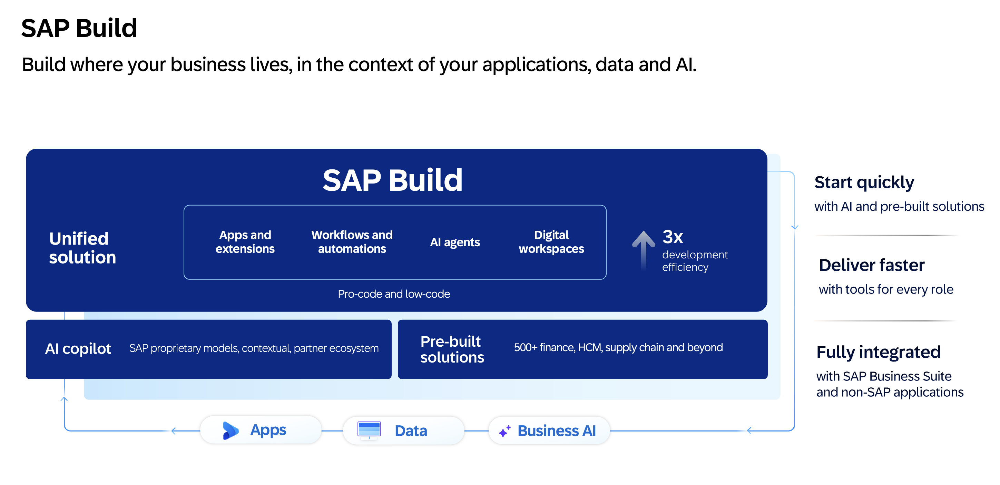
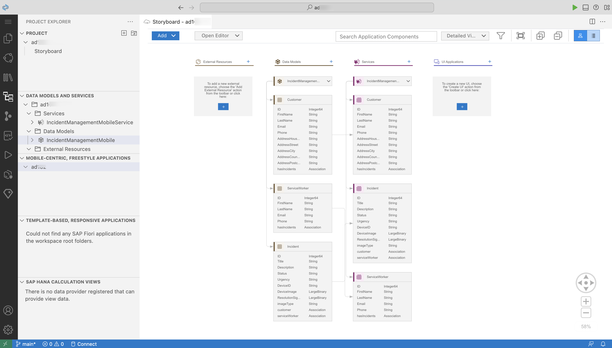

# AD170 - Build scalable enterprise mobile solutions with SAP Build

## SAP Build
SAP Build is a business application development and automation solution with a comprehensive suite of low-code, pro-code, and generative AI tools. It helps you build cloud-ready extensions that maximize your investments across your cloud ERP and application ecosystem. Break down silos by giving cross-functional teams tools to develop business applications collaboratively and accelerate time to value with generative AI and prebuilt solutions that help you stay on budget and ahead of schedule. 

This hands-on exercise will assist you in learning how to **build mobile applications using SAP Build**.

## Description
Accelerate development by using **SAP Build** to consume a SAP Cloud Application Programming (CAP) Model service for mobile development. Build a native, cross-platform mobile application using **SAP Mobile Development Kit** and enhance it using generative AI capabilities via Joule Assistant.

## Requirements
In order to complete the session exercises below, first complete the [pre-requisites](./exercises/ex0/README.md).

## Use Case
ACME is a popular electronics company. ACME hires call center support representatives to process and manage customer incidents. A call center support representative (Processor) receives a phone call from an existing customer and creates a new incident on behalf of the customer. ACME employs technicians who use mobile apps to process these incidents.

### Incident Creation 
- Mary reports an issue she is facing with her ACME electronic device.
- Raj, a support representative, logs the incident using the Incident Management app.
- Raj records Mary's contact information and issue details.

### Incident Resolution (AD170 - This Hands On Session)
- Anna, a technician, uses the ACME Technician Incident Management app.
- Anna views the tasks assigned to her.
- Anna selects a task to view the details.
- Anna travels to Mary's location for on-site service.
- After fixing the issue, Anna uploads a resolution image.
- Anna requests Mary's digital signature for closing the incident.

## Understand your SAP Cloud Application Programming Backend
The back-end for this Hands-On session has been created using SAP Cloud Application Programming Model, which in turn connects to a HANA DB. Three entities are defined in the `schema.cds` file and then exposed as a service.
  

## Exercises
| Exercise Number | Title | Estimated Time (mins) |
| ---- | ---- | --- |
| [Exercise 1](./exercises/ex1/README.md) | Run the Starting Application on Your Device | 15 |
| [Exercise 2](./exercises/ex2/README.md) | Enhance the generated Incidents List and Detail page | 20 |
| [Exercise 3](./exercises/ex3/README.md) | Modify an Incident Record | 40 |
| [Exercise 4](./exercises/ex4/README.md) | Enhance your MDK App using Generative AI via Joule | 15 |

## How to obtain support
Support for the content in this repository is available during the actual time of the online session for which this content has been designed. Otherwise, you may request support via the [Issues](../../issues) tab.

## Additional Support and Learning Resources
- Continue your learning with additional [MDK tutorials](https://help.sap.com/doc/f53c64b93e5140918d676b927a3cd65b/Cloud/en-US/docs-en/guides/getting-started/mdk/overview.html#tutorials).

- Check out the SAP Community for [Mobile Development](https://community.sap.com/topics/mobile-technology).

## License
Copyright (c) 2025 SAP SE or an SAP affiliate company. All rights reserved. This project is licensed under the Apache Software License, version 2.0 except as noted otherwise in the [LICENSE](LICENSES/Apache-2.0.txt) file.