# Exercise 1 - Run the Starting Application on Your Device

## Estimated time

:clock4: 15 minutes

## Objective

In this exercise, you will run a starting SAP Mobile Development Kit (MDK) application on your device.

| Exercise Number | Title |
| --- | --- |
| [Exercise 1.1](#exercise-11---clone-the-mdk-project-in-sap-build-lobby) | Clone the MDK Project in SAP Build Lobby |
| [Exercise 1.2](#exercise-12---provide-your-assigned-service-worker-id-to-filter-related-incidents) | Provide Your Assigned Service Worker ID to Filter Related Incidents |
| [Exercise 1.3](#exercise-13---deploy-the-application) | Deploy the Application |
| [Exercise 1.4](#exercise-14---display-the-qr-code-for-onboarding-the-mobile-app) | Display the QR Code for onboarding the Mobile App |
| [Exercise 1.5](#exercise-15---run-the-app) | Run the App |

### Exercise 1.1 - Clone the MDK Project in SAP Build Lobby

1. Launch the [SAP Build Lobby](https://ad170-k6zq89xc.eu10.build.cloud.sap/lobby) in the Google Chrome browser.

2. Click `tdct3ched1.accounts.ondemand.com` to continue for dry run. SAP IT will remove the default identity provider couple of days before TechEd starts. This step won't be needed anymore. [**to be updated**] 

2. Provide the login credentials that were shared with you during the session. 

    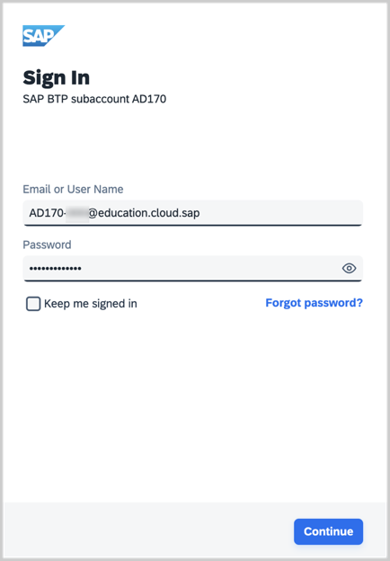

3. Click **Create** > **Clone From Git** to clone a starter MDK project in the Build Lobby.

    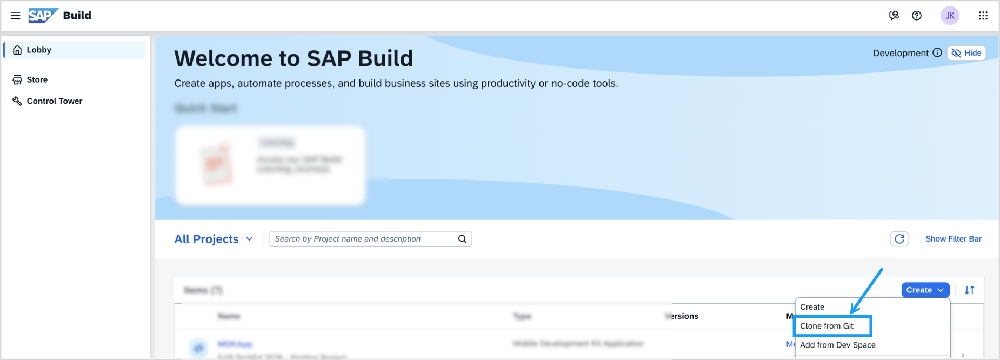  

4. Select the **Mobile Application** type and choose **Next**.

    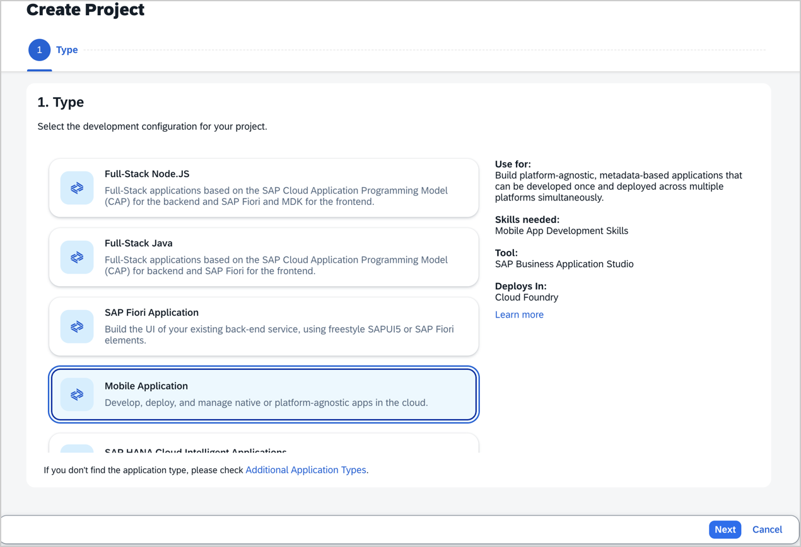  

5. Provide the below information and click **review**.

    | Field | Value |
    |----|----|
    | `Clone from Git` | `https://github.com/jitendrakansal/MDKApp.git`  |
    | `Name` | `MDKApp` |  
    | `Description` | `SAP TechEd 2025`  |
    | `Dev Space` | Leave the default name as it is |  

     >SAP Build recommends the dev space it deems most suitable, and it will automatically create a new one for you if you don't already have one.

    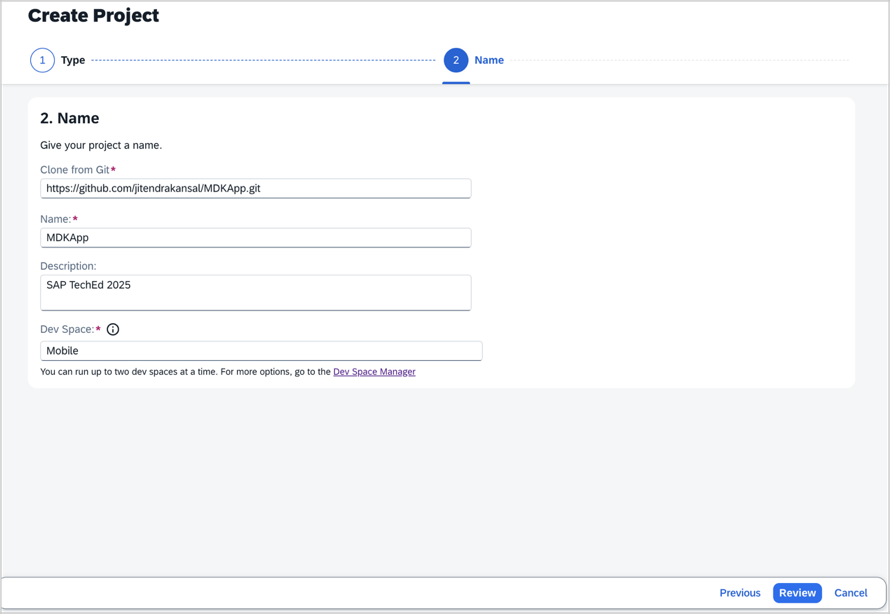  

6. Review the inputs under the Summary tab. If everything looks correct, click **Create** to proceed with creating your project.

    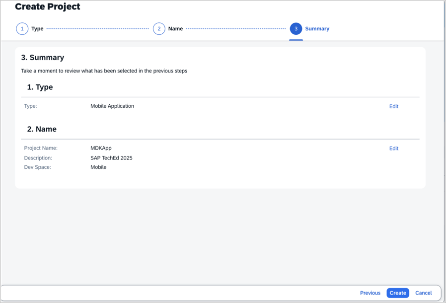  

    A new browser window opens, the development environment is prepared, the Git repository is cloned, and the cloned project opens in SAP Business Application Studio. *This may take 2-3 minutes in creating the required setup.*

    >When you open SAP Business Application Studio for the first time, a consent dialog may appear, requesting permission to track your usage. Please review the information and provide your consent accordingly before proceeding.

    >  

### Exercise 1.2 - Provide Your Assigned Service Worker ID to Filter Related Incidents

The cloned project is presented in a storyboard. The Storyboard provides a graphical view of the application's runtime resources, external resources, UI of the application, and the connections between them. This allows for a quick understanding of the application's structure and components. 

Since the cloned project is not yet connected to SAP Mobile Services, the runtime resources column is blank, and there are no connections displayed. This will be addressed in the project deployment step.

1. Expand the `Pages` &rarr; `Incident`, and click on the `Incident_List.page` to open it with **Page Editor**.

    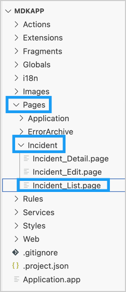   

2. Select the Object Table, look for the **Target** property, and replace the `workerID` with a Service Worker ID value shared with you and then close the page by clicking the `x` sign.

    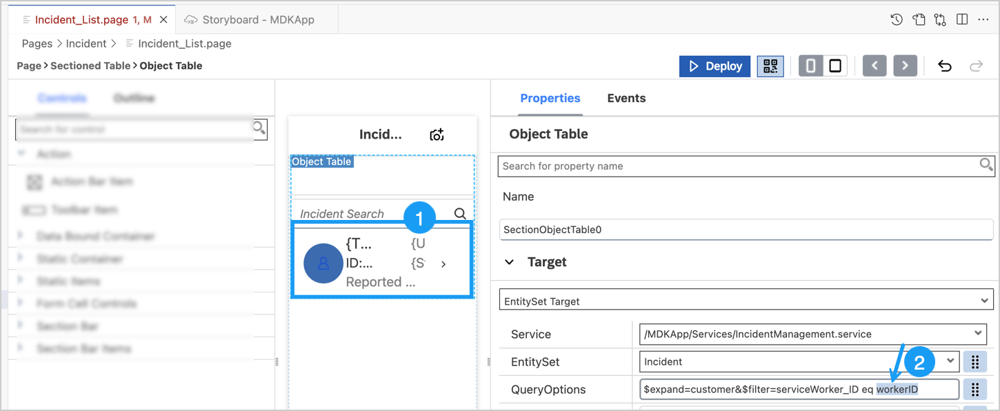  

### Exercise 1.3 - Deploy the Application

You will now deploy the application definitions to SAP Mobile Services.

1. Click the **Deploy** option in the editor's header area, and then choose the deployment target as **Mobile Services** 

    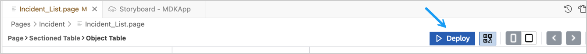 

2. If you don't have an active CF session, you may be prompted to log into Cloud Foundry. If prompted, click **Login** to continue. If not, proceed directly to step 8.

    

3. Choose the **SSO Passcode** as your authentication method, then click on the highlighted hyperlink. This will open a new browser page.

    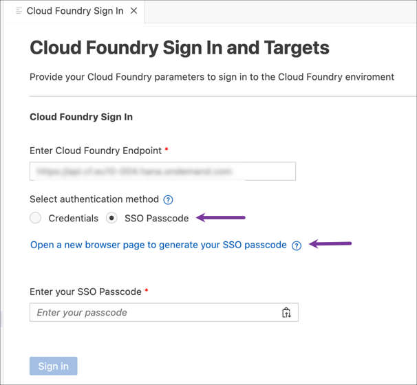

4. A new tab will open in your browser. Enter  `tdct3ched1-platform` as the origin key for the custom IdP, then click on **Sign in with alternative identity provider**.

    

5. Copy the Temporary Authentication Code.

    

6. Switch back to the SAP Business Application Studio page. Paste the copied code into the field labeled **Enter your SSO Passcode** and then click **Sign In**.

    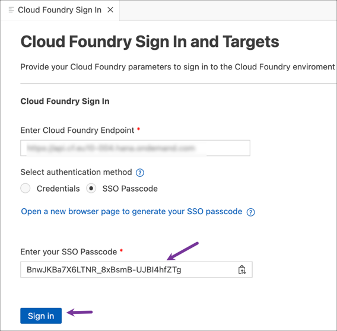

7. You are now signed in to the Cloud Foundry. Set the Cloud Foundry target by choosing the appropriate Organization and space from the dropdown menu and then click on **Apply**. Once the Cloud Foundry target is set, the `Cloud Foundry Sign in` tab will automatically close.

    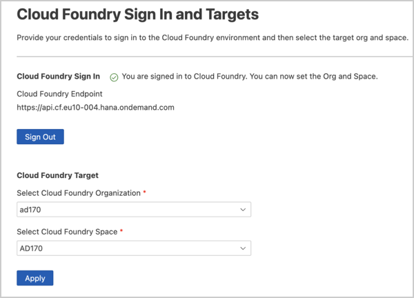
    
8. Select deploy target as **Mobile Services**.

     

9. Select **Standard** Mobile Services Landscape.

      

10. Select the Mobile Services App ID `sap.mobile.user.xyz` assigned to you.

     

    You should see **Deploy to Mobile Services successfully!** message.

     

### Exercise 1.4 - Display the QR Code for onboarding the Mobile App

You will now run the initial application on the Mobile client installed on your device by scanning the on-boarding QR code. 

1. To view the onboarding QR code, click the **Application QR Code** icon in the editor's header area.

    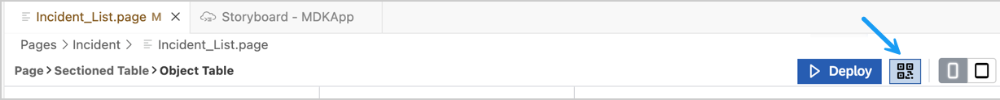

2. The Onboarding QR code is now displayed. Leave the Onboarding dialog box open as you proceed to the next step.

    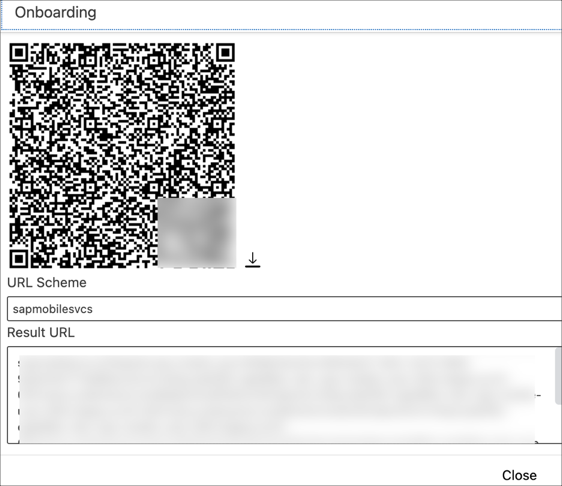

### Exercise 1.5 - Run the App

| Steps | Android | iOS |
| --- | --- | --- |
| 1. Launch **`Mobile Svcs`** app on your mobile device. Tap **Agree** on `End User License Agreement and Privacy Statement`. |  |  |
| 2. Tap **Scan** to start the device camera for scanning the onboarding QR code and grant permission to access the camera. Please note, if you already have the MDK client on-boarded, tap *Get Started* and *Scan new QR code* to continue. |  |  |
| 3. Once the scan succeeds, tap **Continue**. | 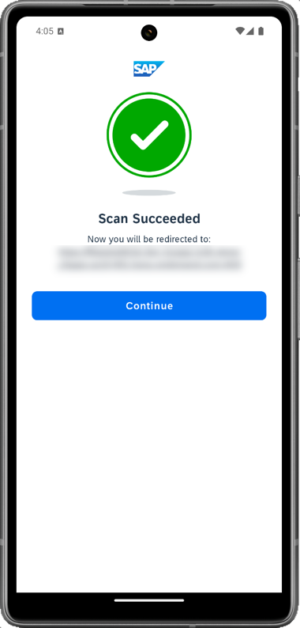 | 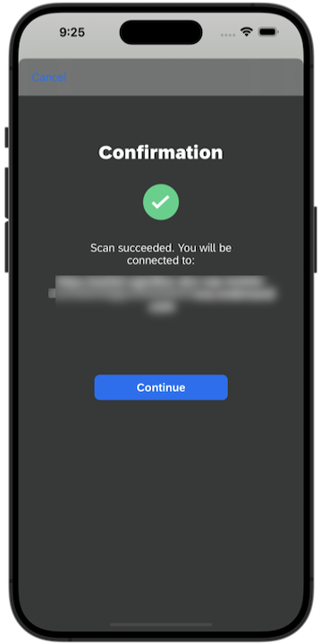 |
| 4. Click `tdct3ched1.accounts.ondemand.com` to continue for dry run. SAP IT will remove the default identity provider couple of days before TechEd starts. This step won't be needed anymore. [**to be updated**] |  | |
| 4. Use the login credentials that were shared with you during the session to log into SAP BTP. | 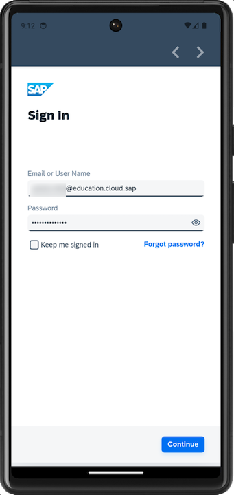 |  |
| 5. Create a passcode that is at least 5 characters long to unlock the app, and then tap **Next**. | 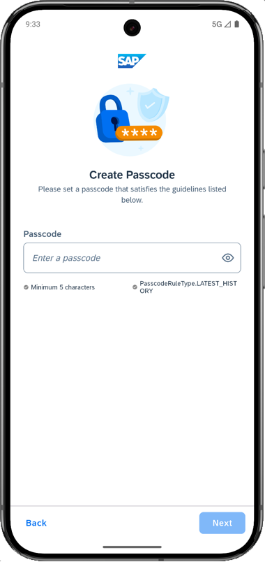 |  |
| 6. Confirm the passcode and tap **Done**. |  |  |
| 7. You have the option to enable Biometric Authentication for faster access to app data. On iOS, tap **Enable** if you wish to use this feature. On Android, provide your biometric information. |  |  |
| 8. Tap **Next**. If you want your MDK client to send you notifications, tap **Allow**, otherwise, tap **Don't allow**. |   | NA |
| 9. Tap on **Now** to accept the deployed metadata definitions. |  |  |
| 10. After accepting the app update, the offline store will initialize. You'll see a list of incidents assigned to you and a user menu icon on the main page. The user menu includes the following items:  - **Sync Changes:** This allows you to upload any local changes from the Mobile client to the backend and download any delta changes from the backend to the Mobile client.  - **Support:** This provides an easy way for users to contact support via a contact cell. The contact information is defined in the global settings.  - **Activity Log** option on the Support page allows the user to toggle client logging on or off, set the log level, set tracing categories, toggle OData tracing and, if enabled in the Mobile Services application, upload the current client logs.   - **Check for Updates:** This checks if new Metadata has been deployed to the Mobile Services App Update. If new Metadata is found, it will be downloaded and prompt the user to apply the changes.  - **About:** This page displays the current user/device ID, Application Name, Metadata version, and Client version information.  - **Logout:** This completely resets the client, erasing any downloaded data and application Metadata, and returns the user to the license agreement screen. | 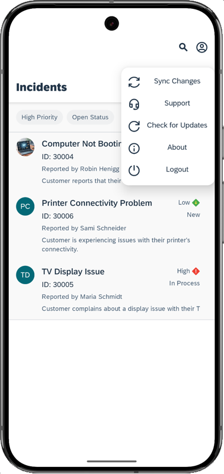 | 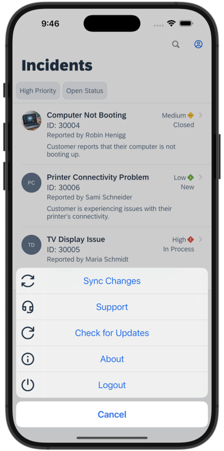 |
| 11. Tap on any of the incidents to navigate to the detail page, where you'll find more information about the incident. You can also access the customer's address via a maps application. If the incident is marked as `closed`, an option to view the image of the defective device will be available. | 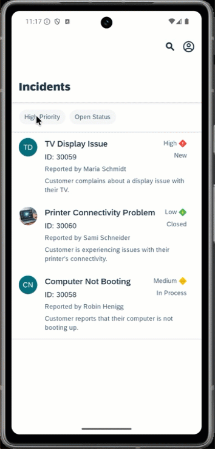 | 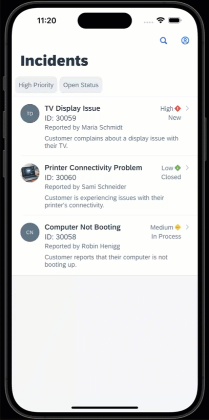 |

## Summary

You now have the starting application running in your MDK client.

## Navigation

|  Next |
|---|
| [Exercise 2](../ex2/README.md) |
