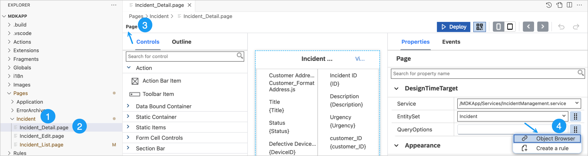
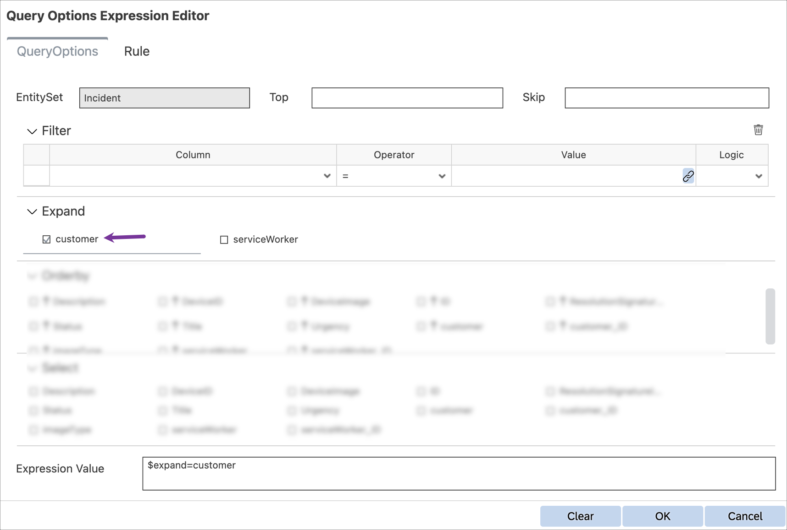
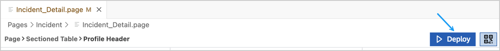
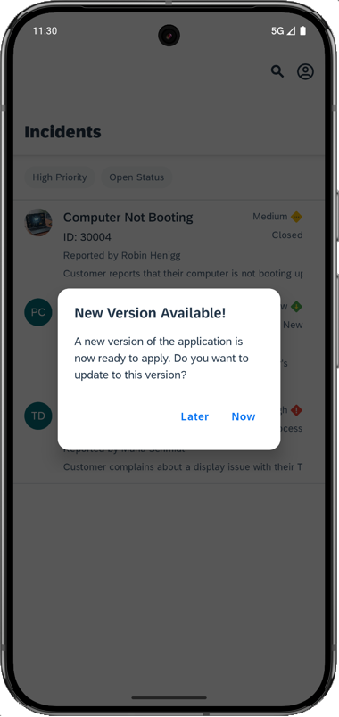
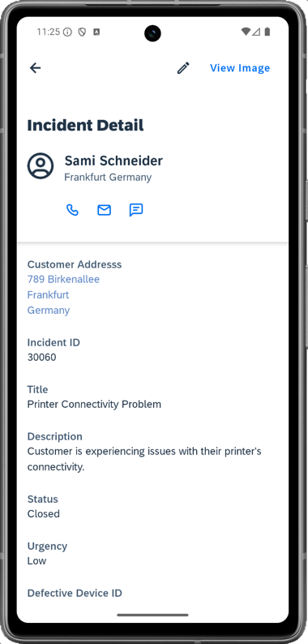
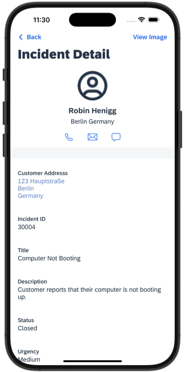

# Exercise 2 - Enhance the generated Incidents List and Detail page

## Estimated time

:clock4: 20 minutes

## Objective

In this exercise, you'll add a Profile Header UI control to the Incident detail page to provide end users with access to communicate with a customer.

| Exercise Number   | Title                                                 |
|-------------------|-------------------------------------------------------|
| [Exercise 2.1](#exercise-21---replace-the-existing-object-header-with-profile-header-ui-control)      | Replace the existing Object Header with Profile Header UI control  |
| [Exercise 2.2](#exercise-22---redeploy-the-application)      | Redeploy the application  |
| [Exercise 2.3](#exercise-23---update-the-mdk-app-with-new-metadata)      | Update the MDK app with new metadata  |

### Exercise 2.1 - Replace the existing Object Header with Profile Header UI control

A Profile header UI control furnishes additional information and enhances access to various communication methods with a customer.

1. Navigate to `Pages` &rarr; `Incident` &rarr; `Incident_Detail.page`. Update the page's `DesignTimeTarget`'s `QueryOptions` to access  Customer information at design time. Click on the three-dot icons to open the Object Browser for the `QueryOptions` property.

     

    >The `DesignTimeTarget` property is similar to Target, but is only used for design time. This allows the Object Browser to show a filtered list based on the Design Time Target rather than the full list of all Entities.

2. Select the `customer` expand property, you'll notice that the expression value updates accordingly. Click **OK** to close the Query Options Expression Editor. You can now access and bind customer information to any control on the detail page.

     

3. Now, you will add the **Profile Header** control to display information such as name, location, and communication methods with a customer.   In the Layout Editor, expand the **Controls** &rarr; **Static Container** group, then drag and drop the **Profile Header** control onto the top of the page area.

     

6. In the **Properties** pane under **Appearance**, clear the default value for the `Description` property. 

7. For the `DetailImage` property, click on the link icon to open the Object Browser, search for the `customer` SAP icon and double click on it. 

     

8. For the `Headline` property, click on the link icon to open the Object Browser and bind to Customer's First and Last names.

     > Ensure that `OData Objects` is selected in the dropdown menu.

    - In the search field, look for `first`, select `FirstName` and **double-click on it**. The binding `{customer/FirstName}` will be generated in the expression box. **Do not close the Object Browser window**.
    - Add a space after the generated value.
    - Look for `last` in the search field, select `LastName` and **click on `Insert`**. You'll notice the binding `{customer/FirstName} {customer/LastName}` generated in the expression box. 
    - Click **OK** to set the value to the control field.

     

9. Follow similar instructions for the `Subheadline` property, binding it to the customer's city and country values `{customer/AddressCity} {customer/AddressCountry}`. 

      

10. Under the `ActivityItems` section in the Properties pane, click **Add** to create a new activity item.

     

11. Expand the newly added item, then click the three-dot icon for the `ActivityValue` to open the Object Browser. Bind the `Phone` property of the Customer entity.

     

12. Add two more activity items in a similar manner for Email and Message, and bind them to the customer's Email and Phone properties.

     

### Exercise 2.2 - Redeploy the application

Now that you have completed the changes to the Incident Detail page, it's time to deploy the changes and see the result.

Click the **Deploy** option in the editor's header area to deploy your changes to Mobile Services.

 

### Exercise 2.3 - Update the MDK app with new metadata

| Steps&nbsp;&nbsp;&nbsp;&nbsp;&nbsp;&nbsp;&nbsp;&nbsp;&nbsp;&nbsp; | Android | iOS&nbsp;&nbsp;&nbsp;&nbsp;&nbsp;&nbsp;&nbsp;&nbsp;&nbsp;&nbsp; |
|---|---|---|
| 1. Tap the **Check for Updates** option in the `User menu` on the Incidents page.| | |
| 2. You will see a `New Version Available!` pop-up.  Tap **Now**.| | |
| 3. On the Detail page, a profile header will display the customer's details and communication items. This will allow you to email, make a phone call, or send a message to the customer.| | |

## Summary

You've enhanced the incident detail page to better suit the technician. They can now easily understand the information and reach out to the customer when needed.

## Navigation

| Previous| Next |
|---|---|
| [Exercise 1](../ex1/README.md) | [Exercise 3](../ex3/README.md) |
