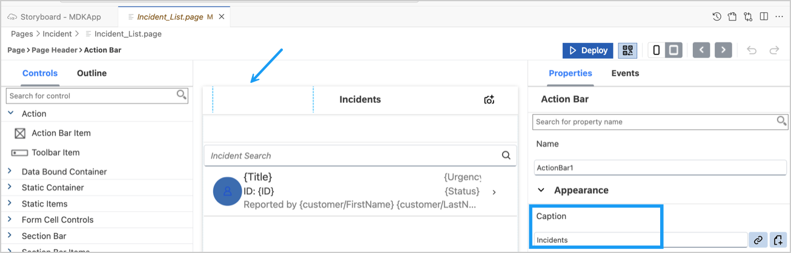
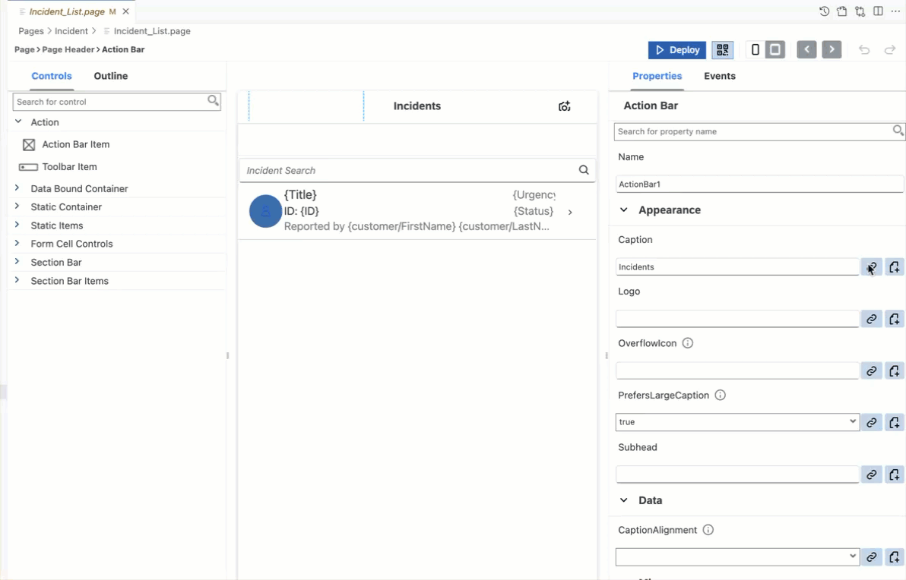
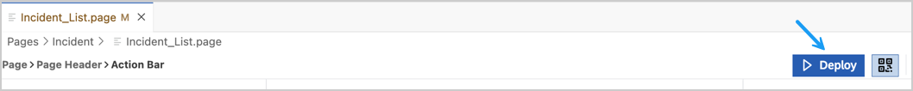
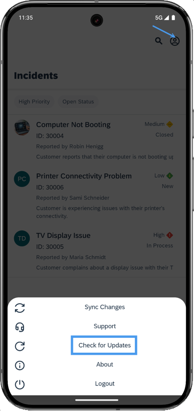
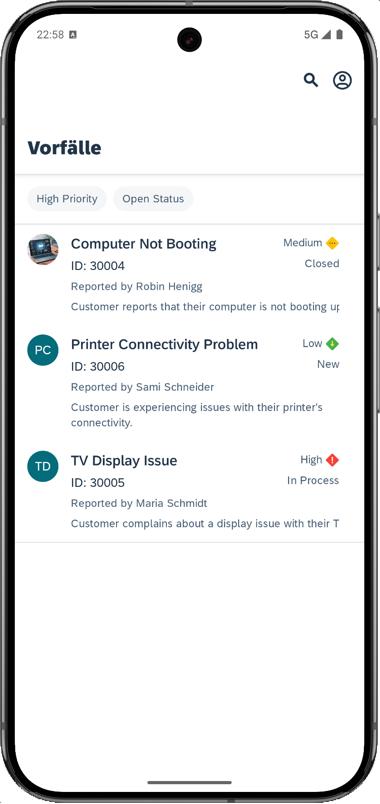
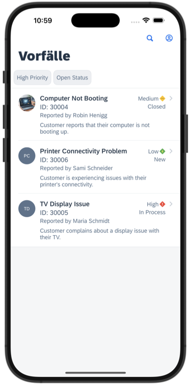

# Exercise 4 - Enhance your MDK App using Generative AI via Joule

## Estimated time

:clock4: 15 minutes

## Objective

In this exercise, you will learn how to enhance your MDK app using GenAI through the Joule Assistant, available in the SAP Build development environment. You'll generate translation files (i18n) in one or more languages using Joule, containing key-value string pairs that support localization. This allows your application to cater to a diverse audience and improves accessibility for users across different regions.

| Exercise Number   | Title                                                 |
|-------------------|-------------------------------------------------------|
| [Exercise 4.1](#exercise-41---generate-i18n-files-in-one-or-more-languages) | Generate i18n Files in One or More Languages |
| [Exercise 4.2](#exercise-42---add-localized-string-formatter) | Add Localized String Formatter |
| [Exercise 4.3](#exercise-43---redeploy-the-application)      | Redeploy the Application                               |
| [Exercise 4.4](#exercise-44---update-the-mdk-app-with-new-metadata)      | Update the MDK App with New Metadata                   |

### Exercise 4.1 - Generate i18n Files in One or More Languages

1. Open the **Joule** panel. 

   

2. Type `/` to access available MDK commands, select `mdk-gen-i18n` to generate the MDK i18n file, choose the first sample prompt (**generate multiple i18n files**), and click the play icon to generate the required information. You can modify the prompt if desired.

   

3. Click any staging file to review its content. Once satisfied, accept all the files. Choose `Merge` option to add the generated files to your project. 

   

   The Generated i18n files are now available in the project.

    

### Exercise 4.2 - Add Localized String Formatter

MDK supports various localization formatter functions, such as Localizable String, Number, Currency, Date, Time, etc. In this exercise, you will use a localization formtter to localized text, such as `Incidents` page caption text available on the `Incident_List.page`.

1. Navigate to `Pages` | `Incidents` | `Incident_List.page` to open it in the MDK page editor. 

2. Click on the Action Bar area (as highlighted in the screenshot) to access the page caption property. 

     

3. Click the **link** icon for the **Caption** property. Select **i18n Objects** from the dropdown and double-click on `Incidents:"Incidents"` to bind page caption to a localizable string.

     

    You may similarly set localized strings for other texts in your project. 

### Exercise 4.3 - Redeploy the Application

Now that you have created the Edit page it is time to deploy the changes to see the result.

1. Click the **Deploy** option in the editor's header area to deploy your changes to Mobile Services.

    

### Exercise 4.4 - Update the MDK App with New Metadata

| Steps | Android | iOS |
|---|---|---|
| 1. Tap the **Check for Updates** option in the `User menu` on the Incident page. |  |  |
| 2. You will see a `New Version Available!` pop-up. Tap **Now**. |  |  |
| 3. To test localized string changes, change the device language to one of the following:   &#9702; Chinese   &#9702; Dutch   &#9702; French   &#9702; German   &#9702; Italian   &#9702; Japanese   &#9702; Spanish    Relaunch the MDK client to see the localized strings for the Products button on the main page.    *Note: These screenshots were taken when the device language was set to **German**.* |  |  |

## Summary

You have learned how to generate translation files using GenAI capabilities in SAP Build. You can further extend your project by generating additional pages and actions using Joule. 

## Navigation

| Previous | Next |
| --- | --- |
| [Exercise 3](../ex3/README.md) | [Conclusion](../../Conclusion.md) |
